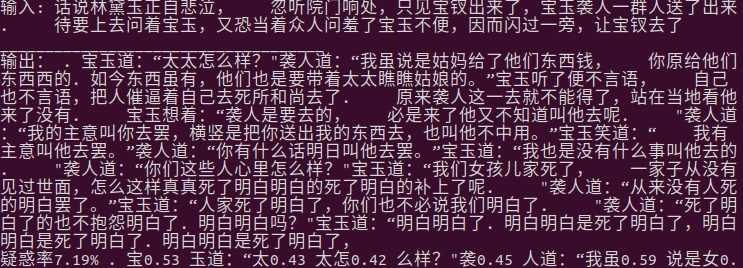
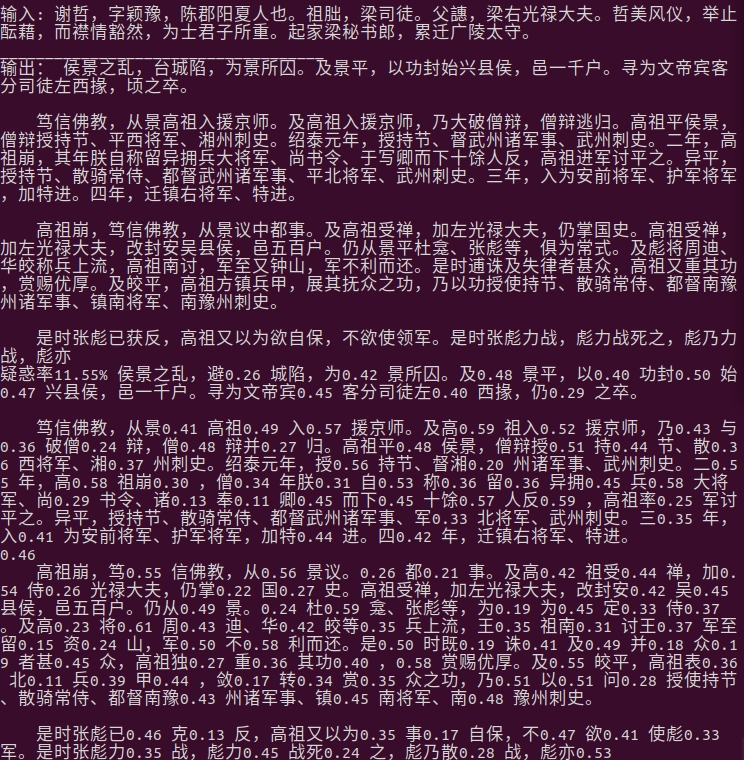
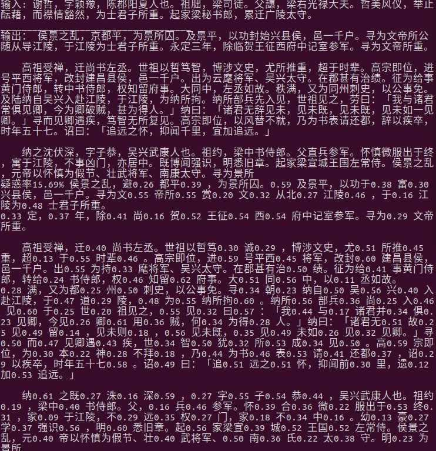
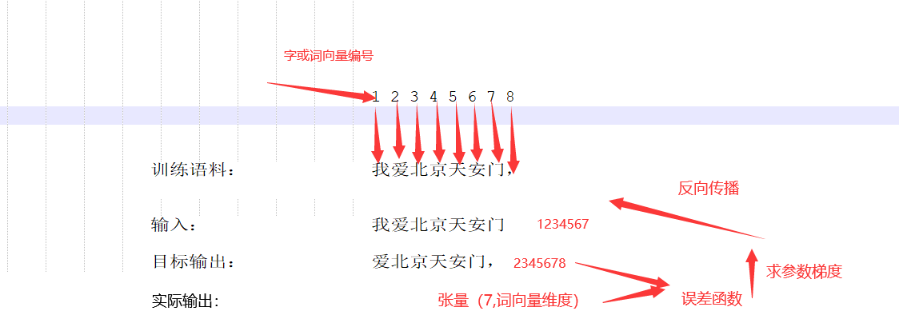
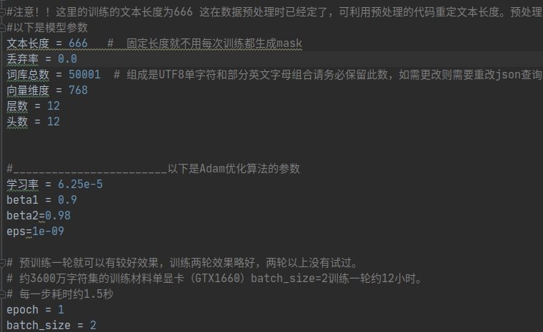
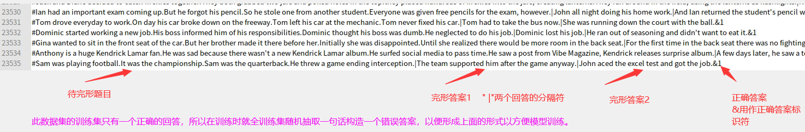
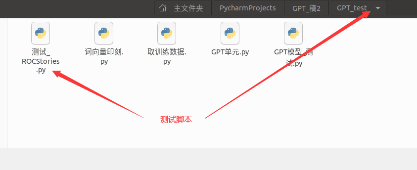
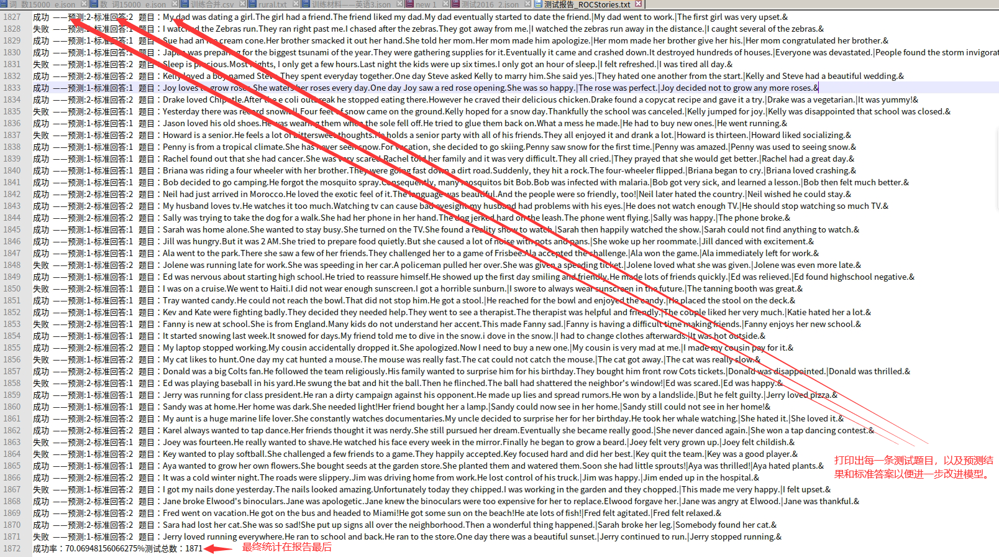

# GPT学习
   本模型主要参考了[SamLynnEvans Transformer](https://github.com/SamLynnEvans/Transformer) 的源码，其次参考了[graykode gpt-2-Pytorch](https://github.com/graykode/gpt-2-Pytorch/tree/master/GPT2)
的源码。
此模型把上文所提Transformer模型的解码部份分离出来 把Relu换成了Gelu，把位置编码方式换成可训练的。 
同时完成了pytorch和mindspore的搭建，这里只上传mindspore的。

理论上GTP这个模型时可以同时处理多种语言的，但处理多种语言会使得模型变得非常庞大而超出我这可怜的GTX1660的能力范围。不过令人可喜的是以现在的硬件条件依然可以勉强完成参数
约1亿的模型训练，训练的方式是先在约1亿字符的语料库上预训练再根据具体任务再训练。
而训练的结果，虽然并不十分完美，但已经给了我很大的惊喜。

如图：
文本生成《西游记》

---

文本生成《红楼梦》

---
文本生成《二十四史——陈书》 

😏感觉这个文言文水平比我好多了，

总的感觉是这个模型对于字词和语法都有较好把握，但对于其中的内在联系却没有学习到，比如唐僧自称老孙。

# 基于mindspore搭建GPT模型的尝试
mindspore模型是为了参加一个基于mindspore的比赛而搭建，这里并不提供预训练文本。

预训练可以是新闻、书籍、代码之类的训练语料，但是语料的长度并没有明确限定。我看见的GPT3中公布的语料样例中有3.9兆大小的文本，以英文为主包含了其它语言，内容各式各样。
我这里用的是666*2的语料长度每666个字或词作为一个Batch Size。训练方式如图：

 - [ ] :注意：在GPT模型的预训练过程中并不只是完成由"我爱北京天安门"预测一个","，
而且通过适当的mask遮罩并行完成了"我"到"爱"的预测，以及 "我爱"到"北"的预测....如此类推。
目前用了大约含有3600万单词的数据集训练了4轮，我估计数据集偏小。

预训练和再训练脚本图：

模型相关参数已经写入训练脚本

 

### 再训练(微调)

相比于GPT3这样的庞大模型，GPT1这样规模的模型必须通过再训练微调参数来实现具体语言任务。具体到当前的任务ROCStories
通过下载此训练集观察可以发现此数据集的训练集和测试集有一个重要的不同，训练集最后只有一项符合前文的正例，没有不符合前文的
负例。我的做法是在整个训练集随机选取一句话作为负例，再构造成如下形式，图：

再将这样一种构造的文本和与预训练一样的方式进行训练。

 - [ ] :综合说来，这里再训练和预训练的方法是一样的。不同的是：再训练时，新构造了一种特殊的文本结构来达到GPT网络完成具体任务的目的。
    

### 测试
测试过程是一段测试材料一个Batch  

最后的分支(Batch Size)的大小在这里为(666*3/每支大小)
这里不用担心材料长短不齐的mask问题。测试材料的格式样例如下，相比原csv格式作了调整。

    {"input": "Sara had lost her cat.She was so sad!She put up signs all over the neighborhood.Then a wonderful thing happened.|Sarah broke her leg.|Somebody found her cat.&", "labe": "2"}
    {"input": "Kelly was playing her new Mario game.She had been playing it for weeks.She was playing for so long without beating the level.Finally she beat the last level.|Kelly was mad about that.|Kelly was so happy to finally beat it.&", "labe": "2"}

如上面两段测试材料这里只关心&后的输出，具体看测试脚本。

测试完成会生成测试报告如图：

### 分析
我认为 虽然此模型和网上流行的GPT模型不完全同，但我认为造成和目标精度（85%。有人用openAI的预训练模型做到了87%以上）差距巨大的一个可能原因是
训练材料偏少。GPT_1的论文中说是用了7000本书。以每本书10万词算，有7亿词的训练材料。另一个可能原因是再训练时实现目标任务方式增加了模型的判断难度。
具体是什么原因需要进行验证才能最终定论。
